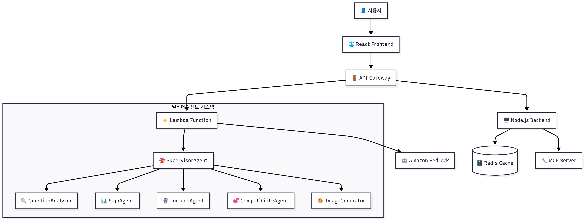
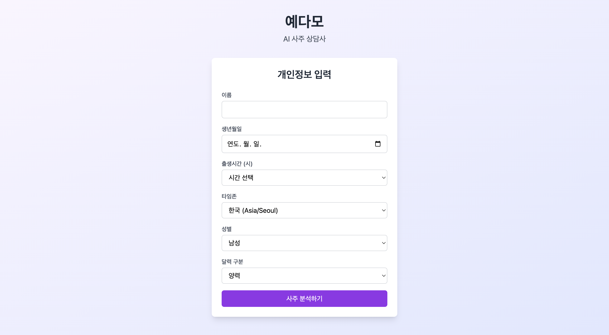
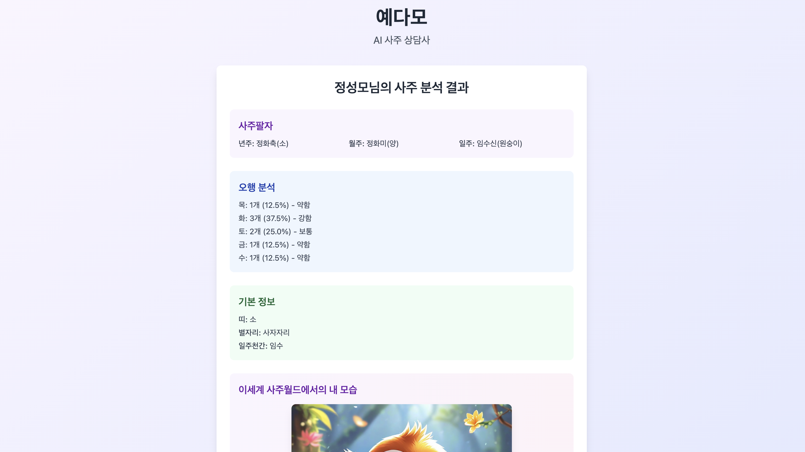
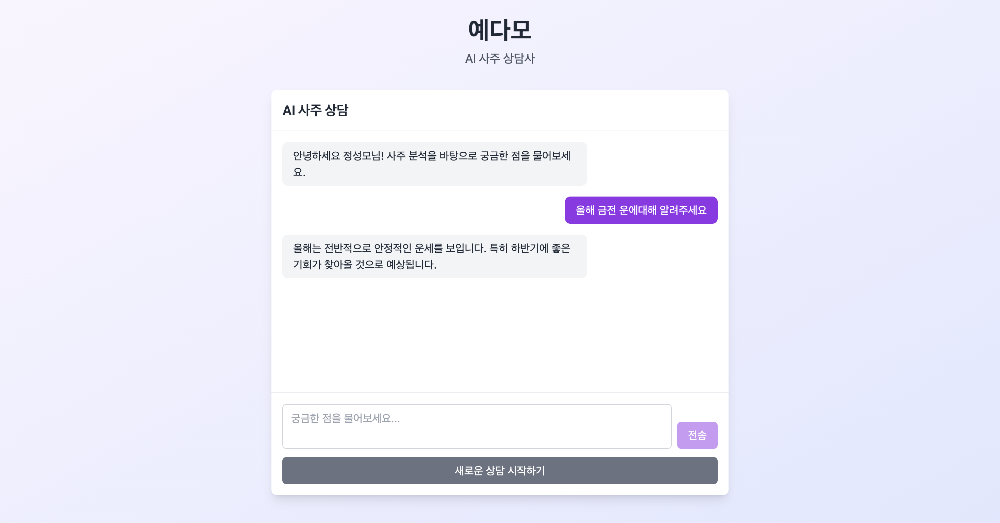

# 🔮 예다모 (YEDAMO) - AI 사주 상담사

> **전통 사주명리학 × AI 기술 = 개인 맞춤형 운세 상담 서비스**

[](https://aws.amazon.com/)
[](https://reactjs.org/)
[](https://nodejs.org/)
[](https://python.org/)
[](https://aws.amazon.com/bedrock/)

## 📖 프로젝트 개요

**예다모(YEDAMO)**는 전통 사주명리학과 최신 AI 기술을 결합한 혁신적인 운세 상담 플랫폼입니다. 복잡한 만세력 계산과 사주 해석을 AI가 자동화하여, 누구나 쉽게 전문적인 사주 상담을 받을 수 있습니다.

### ✨ 핵심 특징
- 🤖 **멀티에이전트 시스템**: 전문 영역별 AI 에이전트가 협업
- 🔧 **MCP 지원**: Model Context Protocol로 정밀한 사주 계산
- 🎨 **AI 이미지 생성**: 12지신 동물 캐릭터 자동 생성
- ⚡ **실시간 상담**: 대화형 인터페이스로 즉시 응답
- 🌐 **풀스택 서비스**: React 프론트엔드 + Node.js 백엔드 + AWS 인프라

## 🏗️ 시스템 아키텍처



## 🚀 주요 기능

### 1. 🎯 정밀 사주 분석
- **사주팔자 계산**: 생년월일시 기반 정확한 사주 도출
- **대운/세운 분석**: 10년 단위 인생 흐름과 연간 운세
- **오행 분석**: 음양오행, 십신, 12운성 종합 해석

### 2. 🤖 지능형 상담 시스템
- **질문 자동 분류**: AI가 질문 유형을 자동 판별
- **맞춤형 응답**: 개인 사주에 맞는 구체적 조언
- **대화형 인터페이스**: 추가 질문으로 심화 상담

### 3. 🎨 AI 이미지 생성
- **12지신 캐릭터**: 개인 띠에 맞는 동물 캐릭터
- **색상 커스터마이징**: 오행에 따른 개인 맞춤 색상
- **Bedrock Nova Canvas**: 고품질 AI 이미지 생성

### 4. ⚡ 고성능 인프라
- **Redis 캐싱**: 빠른 응답을 위한 결과 캐싱
- **멀티에이전트**: 전문 영역별 병렬 처리
- **Auto Scaling**: AWS 서버리스 자동 확장

## 🛠️ 기술 스택

### Frontend
- **React 18** - 모던 UI 프레임워크
- **Vite** - 빠른 개발 환경
- **Tailwind CSS** - 유틸리티 기반 스타일링
- **Axios** - HTTP 클라이언트

### Backend
- **Node.js** - 서버 런타임
- **Express** - 웹 프레임워크
- **Redis** - 인메모리 캐싱
- **MCP SDK** - Model Context Protocol

### AWS Infrastructure
- **Lambda** - 서버리스 컴퓨팅
- **API Gateway** - REST API 관리
- **Bedrock** - AI 모델 서비스
- **ElastiCache** - 관리형 Redis
- **CloudWatch** - 모니터링 및 로깅

### AI & ML
- **Claude-3-Haiku** - 자연어 처리
- **Nova Canvas** - 이미지 생성
- **MCP Protocol** - 정밀 사주 계산

## 데모 캡처






## 📦 설치 및 실행

### 사전 요구사항
```bash
# Node.js 18+ 설치 확인
node --version

# Python 3.11+ 설치 확인
python --version

# AWS CLI 설치 및 구성
aws configure
```

### 로컬 개발 환경
```bash
# 1. 저장소 클론
git clone https://github.com/your-username/yedamo-aws-hackathon.git
cd yedamo-aws-hackathon

# 2. 프론트엔드 실행
cd frontend
yarn install
yarn dev

# 3. 백엔드 실행 (새 터미널)
cd backend
yarn install
yarn dev

# 4. Redis 실행 (Docker)
docker run -d -p 6379:6379 redis:alpine
```

## 🔧 API 사용법

### 기본 사주 분석
```bash
curl -X POST https://your-api-url/saju/basic \
  -H "Content-Type: application/json" \
  -d '{
    "name": "김다롬",
    "birth_info": {
      "year": 1997,
      "month": 5,
      "day": 19,
      "hour": 12,
      "gender": "female",
      "region": "korea"
    }
  }'
```

### 상담 질문
```bash
curl -X POST https://your-api-url/saju/consultation \
  -H "Content-Type: application/json" \
  -d '{
    "cache_key": "user_cache_key",
    "question": "올해 연애운은 어떤가요?"
  }'
```

### 이미지 생성
```bash
curl -X POST https://your-api-url/image \
  -H "Content-Type: application/json" \
  -d '{
    "color": "빨간",
    "animal": "용"
  }'
```

## 🧪 테스트

### 단위 테스트
```bash
# 백엔드 테스트
cd backend
npm test

# 프론트엔드 테스트
cd frontend
npm test
```

### API 테스트
```bash
# 사주 분석 테스트
python test/test_client_new.py

# 이미지 생성 테스트
python test_image_api.py
```

## 🔒 보안

- **IAM 역할**: 최소 권한 원칙 적용
- **API 키 관리**: AWS Secrets Manager 사용
- **CORS 설정**: 허용된 도메인만 접근
- **입력 검증**: 모든 사용자 입력 검증

## 📈 모니터링

- **CloudWatch**: 실시간 메트릭 및 로그
- **X-Ray**: 분산 추적 및 성능 분석
- **알람 설정**: 오류율 및 응답시간 모니터링
