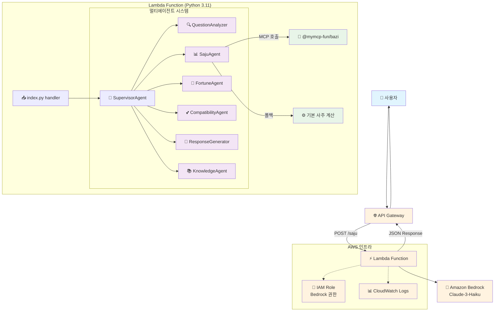
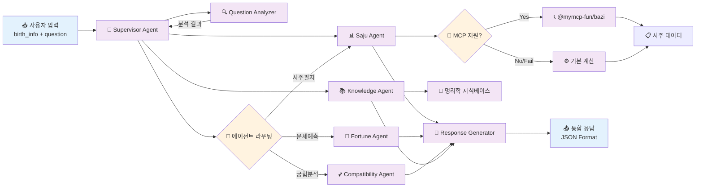
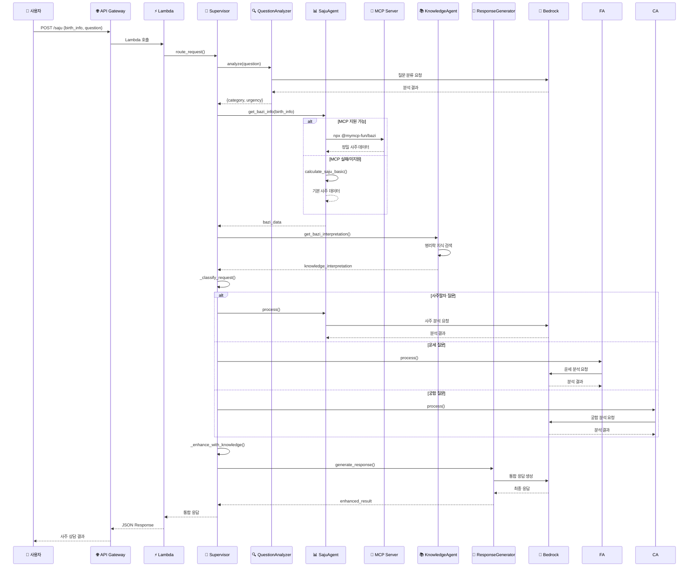

# 예다모 AI 사주 상담 서비스 - 현재 구현 아키텍처

## 전체 시스템 아키텍처



## 멀티에이전트 시스템 상세 구조



## 데이터 흐름 다이어그램



## AWS 리소스 구성

```mermaid
graph TB
    subgraph "AWS Account"
        subgraph "API Gateway"
            REST[REST API<br/>yedamo-saju-service]
            Resource[/saju Resource]
            Method[POST Method]
            REST --> Resource
            Resource --> Method
        end
        
        subgraph "Lambda"
            Function[Lambda Function<br/>Python 3.11<br/>512MB, 60s timeout]
            Code[Code Package<br/>- index.py<br/>- supervisor.py<br/>- agents/]
            Env[Environment Variables<br/>MODEL_ID<br/>SUPERVISOR_ENABLED]
            Function --> Code
            Function --> Env
        end
        
        subgraph "IAM"
            Role[Lambda Execution Role]
            BasicPolicy[AWSLambdaBasicExecutionRole]
            BedrockPolicy[Bedrock InvokeModel Policy]
            Role --> BasicPolicy
            Role --> BedrockPolicy
        end
        
        subgraph "Bedrock"
            Claude[Claude-3-Haiku<br/>anthropic.claude-3-haiku-20240307-v1:0]
        end
        
        subgraph "CloudWatch"
            Logs[Lambda Logs<br/>/aws/lambda/function-name]
        end
        
        Method --> Function
        Function --> Role
        Function --> Claude
        Function --> Logs
    end
    
    %% 외부 연결
    Internet[🌐 Internet] --> REST
    MCP_External[📦 NPM Registry<br/>@mymcp-fun/bazi] -.-> Function
    
    %% 스타일링
    classDef awsService fill:#ff9800,color:#fff
    classDef compute fill:#4caf50,color:#fff
    classDef storage fill:#2196f3,color:#fff
    classDef security fill:#f44336,color:#fff
    classDef external fill:#9e9e9e,color:#fff
    
    class REST,Resource,Method,Claude,Logs awsService
    class Function,Code,Env compute
    class Role,BasicPolicy,BedrockPolicy security
    class Internet,MCP_External external
```

## 에이전트별 역할 및 특징

| 에이전트 | 역할 | 주요 기능 | 특징 |
|---------|------|-----------|------|
| **SupervisorAgent** | 🎯 총괄 관리자 | - 요청 라우팅<br/>- 에이전트 조율<br/>- 응답 통합 | - 지능형 라우팅<br/>- 폴백 메커니즘<br/>- RAG 통합 |
| **QuestionAnalyzer** | 🔍 질문 분석가 | - 질문 분류<br/>- 긴급도 판단<br/>- 의도 파악 | - Bedrock 기반 분석<br/>- 카테고리 분류 |
| **SajuAgent** | 📊 사주 전문가 | - 사주팔자 계산<br/>- MCP 연동<br/>- 기본 성격 분석 | - MCP 우선 사용<br/>- 폴백 지원<br/>- 정밀 계산 |
| **FortuneAgent** | 🔮 운세 예측가 | - 대운/세운 분석<br/>- 월운/일운 예측<br/>- 시기별 조언 | - 시간대별 분석<br/>- 구체적 예측 |
| **CompatibilityAgent** | 💕 궁합 분석가 | - 인간관계 분석<br/>- 연애/결혼 궁합<br/>- 상성 진단 | - 관계 중심 분석<br/>- 실용적 조언 |
| **ResponseGenerator** | 📝 응답 생성기 | - 통합 응답 생성<br/>- 자연어 처리<br/>- 형식 표준화 | - 일관된 형식<br/>- 이해하기 쉬운 설명 |
| **KnowledgeAgent** | 📚 지식 관리자 | - RAG 지식베이스<br/>- 명리학 이론<br/>- 전문 해석 | - 전통 이론 기반<br/>- 신뢰성 높은 해석 |

## 기술 스택 및 특징

### 🛠️ 기술 스택
- **Backend**: Python 3.11, AWS Lambda
- **AI/ML**: Amazon Bedrock (Claude-3-Haiku)
- **API**: AWS API Gateway (REST)
- **Infrastructure**: AWS CDK
- **MCP**: @mymcp-fun/bazi (Node.js)
- **Monitoring**: CloudWatch Logs

### ⭐ 주요 특징
1. **멀티에이전트 아키텍처**: 전문 영역별 에이전트 분리
2. **지능형 라우팅**: 질문 분석 기반 적절한 에이전트 선택
3. **MCP 지원**: 정밀한 사주 계산을 위한 외부 패키지 연동
4. **폴백 메커니즘**: MCP 실패 시 기본 계산으로 대체
5. **RAG 통합**: 명리학 전문 지식베이스 활용
6. **서버리스**: AWS Lambda 기반 확장 가능한 구조
7. **CORS 지원**: 웹 프론트엔드 연동 준비

### 🔄 처리 흐름
1. **요청 수신** → API Gateway
2. **질문 분석** → QuestionAnalyzer
3. **사주 계산** → SajuAgent (MCP/폴백)
4. **전문 분석** → 해당 에이전트
5. **지식 보강** → KnowledgeAgent (RAG)
6. **응답 통합** → ResponseGenerator
7. **결과 반환** → JSON 형식

이 아키텍처는 확장 가능하고 유지보수가 용이하며, 각 에이전트의 독립적인 개발과 테스트를 지원합니다.